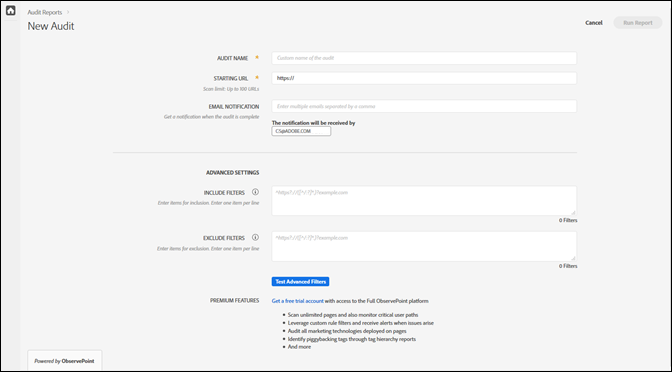

# 새 감사 만들기{#create-a-new-audit}

>[!NOTE]
>
>사용자는 한 번에 1회의 감사만 실행하도록 제한됩니다. 실행 중인 감사와 동일한 설정으로 감사를 시작하려고 하면 오류가 발생합니다. 현재 실행 중인 감사를 취소하고 새 감사를 만들려면 오류 메시지의 링크를 사용할 수 있습니다.

원하는 경우 페이지 하단에 있는 링크를 사용하여 ObservePoint의 모든 기능을 제공하는 무료 체험판 계정에 액세스할 수 있습니다.

1. Auditor 목록에서 **[!UICONTROL 새 감사]**&#x200B;를 클릭합니다.

   [!DNL New Audit] 화면이 열립니다.

   

1. (필수) 감사의 이름을 지정합니다.

   이름은 최대 250자까지 사용할 수 있습니다.
1. (필수) 시작 URL을 지정합니다.

   시작 URL을 지정할 때 프로토콜이 필요합니다. 시작 URL은 감사에서 크롤링을 시작하는 페이지입니다. 시작되면 Auditor는 시작 URL에서 시작되는 링크를 따라 최대 500페이지를 크롤링합니다. 자세한 내용은 [필터 포함 및 제외](../create-audit/filters.md)를 참조하십시오. 시작 URL은 최대 250자까지 사용할 수 있습니다.

   >[!NOTE]
   >
   >경우에 따라 500페이지 검사를 완료하는 데 최대 48시간이 걸릴 수 있습니다.

1. 이 감사에 대한 알림에 하나 이상의 이메일 주소를 지정합니다.

   각 주소는 쉼표로 구분하여 여러 개의 이메일을 지정할 수 있습니다. 요청자는 기본적으로 알림을 받습니다. 이메일 주소는 실시간으로 확인됩니다. 잘못된 주소를 입력하면 화면에 알림 메시지가 표시됩니다.

   각 이메일은 도메인 끝부분(예: .com)을 포함하여 250자 이내로 제한됩니다.
1. 포함 필터를 지정합니다.

   이 필드에는 완전 일치 URL, 부분 URL 또는 정규 표현식이 포함될 수 있습니다. 모든 URL을 일치시키려는 기준에 대해 이 필드를 사용합니다. 포함 필터 기준과 일치하지 않는 크롤링된 모든 URL은 감사 결과에 포함되지 않습니다.

   감사에서 검사할 디렉토리를 입력할 수 있습니다. 도메인 간 또는 자체 참조 감사를 수행할 수도 있으며, 한 도메인에서 감사를 시작하고 다른 도메인에서 감사를 끝내야 합니다. 이렇게 하려면 트래버스할 도메인을 입력합니다.복잡한 URL 패턴의 경우 정규 표현식을 사용합니다.

   >[!NOTE]
   >
   >필터에 페이지를 포함하지만 시작 URL에 연결되어 있지 않거나 Auditor가 해당 페이지에 도달하기 전에 500페이지를 검사하면 페이지가 검사되지 않고 테스트 결과에 포함되지 않습니다.

   포함 필터는 행당 1,000자로 제한됩니다.

   자세한 내용은 [포함 목록](../create-audit/filters.md)을 참조하십시오.
1. 제외 필터를 지정합니다.

   제외 목록은 URL이 감사되지 않도록 합니다. 포함 목록에서와 마찬가지로 완전 일치 URL, 부분 URL 또는 정규 표현식을 사용합니다.

   한 가지 일반적인 방법은 감사에 사용자 세션이 있는 경우 로그아웃 링크를 제외하는 것입니다(예: `/logout`은(는) `/logout` 문자열을 포함하는 모든 URL을 의미함).

   제외 필터는 행당 1,000자로 제한됩니다.

   자세한 내용은 [제외 목록](../create-audit/filters.md)을 참조하십시오.
1. (선택 사항) 원하는 경우 포함 및 제외 필터를 테스트하고 URL을 테스트할 수 있습니다.

   필터 및 URL을 입력한 다음 **[!UICONTROL 적용]**&#x200B;을 클릭하여 테스트를 실행합니다.

   

1. **[!UICONTROL 보고서 실행]**&#x200B;을 클릭합니다.
