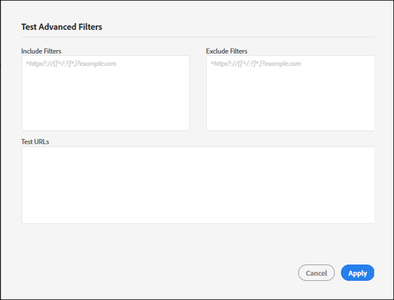

# Create a new audit{#create-a-new-audit}

>[!NOTE]
>
>사용자는 한 번에 한 번의 감사 실행으로 제한됩니다. 실행 중인 설정과 동일한 설정으로 감사를 시작하려고 하면 오류가 발생합니다. 현재 실행 중인 감사를 취소하여 새 감사를 만들려면 오류 메시지의 링크를 사용할 수 있습니다.

원하는 경우 페이지 하단에 있는 링크를 사용하여 ObservePoint의 모든 기능을 갖춘 무료 시험버전 계정에 액세스합니다.

1. 감사자 목록에서 새 **[!UICONTROL 감사를 클릭합니다]**.

   The [!DNL New Audit] screen opens.

   

1. (필수) 감사의 이름을 지정합니다.

   이름은 최대 250자까지 사용할 수 있습니다.
1. (필수) 시작 URL을 지정합니다.

   시작 URL을 지정할 때는 프로토콜이 필요합니다. 시작 URL 파섹 시작되면 감사자는 최대 500페이지를 크롤하며 시작 URL에서 시작되는 링크를 따릅니다. 자세한 [내용은 필터 포함 및](../create-audit/filters.md#concept-23531490bb124981ba807ed1806e3257) 제외를 참조하십시오. 시작 URL은 최대 250자까지 입력할 수 있습니다.

   >[!NOTE]
   >
   >경우에 따라 500페이지 검색을 완료하는 데 최대 48시간이 걸릴 수 있습니다.

1. 이 감사에 대한 알림에 대해 하나 이상의 이메일 주소를 지정합니다.

   각 주소를 쉼표로 구분하여 여러 개의 이메일을 지정할 수 있습니다. 요청자는 기본적으로 알림을 받습니다. 이메일 주소는 실시간으로 확인됩니다. 잘못된 주소를 입력하면 화면에 알림 메시지가 표시됩니다.

   각 이메일은 도메인 끝(예: .com)을 포함하여 250자 이내로 제한됩니다.
1. 필터 포함을 지정합니다.

   이 필드에는 정확한 URL, 부분 URL 또는 정규 표현식이 포함될 수 있습니다. 모든 URL 파섹 필터 포함 기준과 일치하지 않는 크롤링 URL은 감사 결과에 포함되지 않습니다.

   감사에서 스캔할 디렉토리를 입력할 수 있습니다. 또는 도메인 간 또는 자체 참조 감사를 수행하여 한 도메인에서 감사를 시작하고 다른 도메인에 대한 감사를 끝내야 합니다. 이렇게 하려면 트래버스할 도메인을 입력합니다.복잡한 URL 패턴의 경우 정규 표현식을 사용합니다.

   >[!NOTE]
   >
   >필터에 페이지를 포함하지만 시작 URL에 연결되어 있지 않거나 Auditor가 해당 페이지에 도달하기 전에 500페이지를 스캔하면 페이지가 검색되지 않고 테스트 결과에 포함되지 않습니다.

   포함 필터는 라인당 1,000자로 제한됩니다.

   자세한 [내용은](../create-audit/filters.md#section-7626060a56a24b658f8c05f031ac3f5f) 목록 포함을 참조하십시오.
1. 제외 필터를 지정합니다.

   제외 목록은 URL이 감사되지 않도록 합니다. 목록 포함에서와 마찬가지로 정확한 URL, 부분 URL 또는 정규 표현식을 사용합니다.

   한 가지 일반적인 방법은 감사에 사용자 세션이 있는 경우 로그아웃 링크를 제외하는 것입니다(예:를 `/logout`의미합니다. `/logout`)

   제외 필터는 행당 1,000자로 제한됩니다.

   자세한 [내용은](../create-audit/filters.md#section-00aa5e10c878473b91ba0844bebe7ca9) 목록 제외를 참조하십시오.
1. (선택 사항) 원하는 경우 포함 및 제외 필터를 테스트하고 URL을 테스트할 수 있습니다.

   필터 및 URL을 입력한 다음 적용을 **[!UICONTROL 클릭하여]** 테스트를 실행합니다.

   

1. **[!UICONTROL 보고서 실행]**&#x200B;을 클릭합니다.
