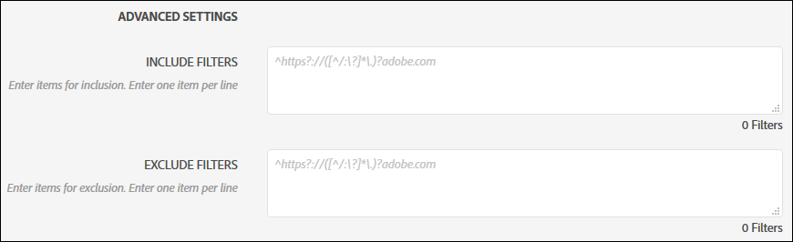
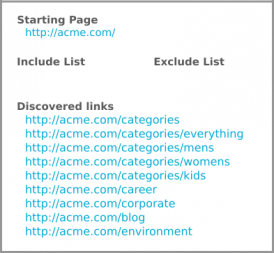
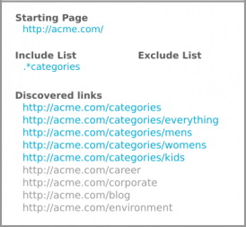
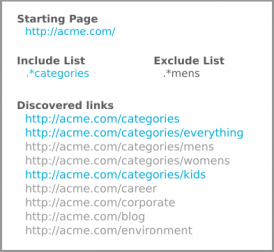
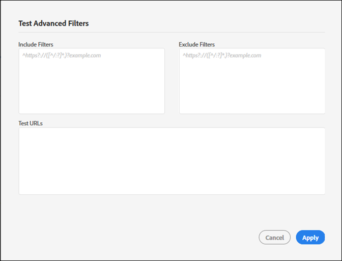

# 포함 및 제외 필터{#include-and-exclude-filters}

포함 필터는 시작 URL에서 감사가 크롤링할 수 있는 링크를 제한합니다. 제외 필터는 감사에서 링크를 크롤링하지 않도록 합니다.

<!--
Content from ObservePoint (https://help.observepoint.com/articles/2872121-include-and-exclude-filters) with their permission. Modified slightly for style and Auditor emphasis.
-->

포함 필터 및 제외 필터는 감사에 대한 지침을 제공합니다. 포함 및 제외 필터를 비워 두면 감사가 시작 URL의 링크부터 시작하여 모든 링크를 크롤링할 수 있습니다.



포함 필터, 제외 필터 또는 두 가지 필터 조합을 적용하여 감사에서 크롤링할 수 있는 링크에 대한 지침을 제공할 수 있습니다.

[!UICONTROL 포함 필터] 필드의 항목은 해당 항목과 일치하는 페이지만 검사하도록 제한합니다. [!UICONTROL 제외 필터] 필드의 항목은 해당 항목과 일치하는 페이지를 검사하지 못하도록 합니다.

포함 및 제외 필터는 전체 URL, 부분 URL 또는 유효한 페이지와 일치하는 정규 표현식일 수 있습니다.

## 우선 순위 {#section-e9d42419dd3f459bb20e7a33c6104f12}

1. **시작 URL**&#x200B;은 다른 URL보다 우선하며, URL이 제외 필터의 항목과 일치하는 경우라도 감사 중에 항상 방문하게 됩니다. 시작 URL은 항상 다른 URL 보다 먼저 방문합니다.

   

   위의 이미지에서 감사는 시작 페이지의 `document.links` 속성에서 링크를 검색합니다. 이러한 링크는 감사에서 검사할 수 있습니다.

1. **포함 URL**&#x200B;은 시작 페이지에서 연결되어야 합니다. 그렇지 않으면 검색하거나 방문할 수 없습니다.

   

   위의 이미지에서 포함 필터를 추가하면 해당 URL이 필터와 일치하는 URL로 제한됩니다. 이제 5개의 링크만 감사에서 검사할 수 있습니다.

1. **제외 URL**&#x200B;은 적합 조건에서 링크를 제거합니다.

   

   위의 이미지에서 제외 필터를 추가하면 해당 링크에서 URL이 차단됩니다. 이제 3개의 링크만 감사에서 검사할 수 있습니다.

## 시작 URL {#section-ccb46abcd96f4a8ab171245015d2b724}

Adobe Experience Platform Auditor는 시작 URL을 위한 단일 페이지가 필요합니다. 시작 URL은 항상 다른 URL 보다 먼저 방문합니다. 시작 페이지에서 검색된 모든 링크는 포함 및 제외 필터에 따라 방문할 수 있습니다. 제외 항목이 시작 URL과 일치하는 경우 무시됩니다.

## 포함 필터 {#section-7626060a56a24b658f8c05f031ac3f5f}

포함 필터는 감사 중에 검사할 수 있는 링크를 제한합니다. 포함 필터 대상:

* 정규화된 URL
* 부분 URL
* 전체 또는 부분 URL과 일치하는 정규 표현식
* 위의 모든 조합

포함 필터에 URL 또는 정규 표현식을 추가한다고 해서 해당 특정 URL이 감사에서 검사되는 것은 아닙니다. 감사는 시작 URL에서 링크를 검사한 다음 자격 조건을 갖춘 링크를 통해 탐색합니다. 감사는 검색한 URL이 500개 제한에 도달하거나 더 이상 자격 조건을 갖춘 링크를 찾을 수 없을 때까지 검사 및 탐색 프로세스를 계속합니다.

>[!NOTE]
>
>경우에 따라 500페이지 검사를 완료하는 데 최대 48시간이 걸릴 수 있습니다.

기본적으로 감사는 시작 URL의 모든 하위 도메인을 검사합니다. 포함 필터를 제공하여 명시적으로 재정의되지 않는 한 검사 시 다음 regex 포함 필터를 사용합니다.

`^https?://([^/:\?]*\.)?mysite.com`

이렇게 하면 시작 URL 페이지에 있는 모든 링크를 방문할 수 있습니다. 시작 URL의 하위 도메인에 있는 모든 페이지와 일치합니다.

기본 포함 필터를 사용하면 감사 시 크롤링할 수 있는 광범위한 범위가 제공됩니다. 특정 섹션이나 페이지로 바로 이동하려면 이 상자에 필터를 추가하여 특정 감사 지침을 제공합니다. 이 경우 기본값을 감사에서 검사할 디렉토리로 바꿉니다. 또한 포함 필터를 사용하여 한 도메인에서 감사를 시작하고 다른 도메인에서 끝나야 하는 도메인 간 감사를 수행할 수도 있습니다. 이를 위해 트래버스하려는 도메인을 입력합니다. 어떤 경우든 포함 필터 URL을 찾으려면 감사된 페이지에서 해당 URL이 검색되어야 합니다.

포함 필터에는 완전 일치 URL, 부분 URL 또는 정규 표현식이 포함될 수 있습니다. 예를 들어 시작 URL이 [!DNL http://mysite.com] 인 경우 기본적으로 다음 페이지를 검사할 수 있습니다(굵은 서체 참고).

```html
http://mysite.com
http
<b>s</b>://mysite.com
http://
<b>www</b>.mysite.com/home
http://
<b>dev</b>.mysite.com/home
http://
<b>my</b>.mysite.com/products/products_and_services.html
```

복잡한 URL 패턴의 경우 [ObservePoint 의 정규 표현식 테스터](https://regex.observepoint.com/)를 사용합니다.

## 제외 필터 {#section-00aa5e10c878473b91ba0844bebe7ca9}

제외 필터는 URL이 감사되지 않도록 합니다. 완전 일치 URL, 부분 URL 또는 정규 표현식을 사용할 수 있습니다. 제외 필터의 항목과 일치하는 URL은 방문되지 않습니다. 시작 URL이 제외 필터에 포함된 경우 제외되지 않습니다. 시작 URL은 항상 감사에서 검사됩니다.

## 필터 및 URL 테스트 {#section-3cfa125b1756411395a64701e128efa0}

Platform Auditor 내에서 필터 및 URL을 테스트할 수 있습니다.

감사를 만드는 동안 **[!UICONTROL 고급 필터 테스트]**&#x200B;를 클릭합니다. 필터와 URL을 입력한 다음 **[!UICONTROL 적용]**&#x200B;을 클릭합니다.



## ObservePoint 설명서 {#section-79cdc8e850d047969b6d2badf6bbd6f9}

이 문서는 ObservePoint와 협력하여 개발되었습니다. 최신 정보는 [ObservePoint 설명서](https://help.observepoint.com/)를 참조하십시오.
