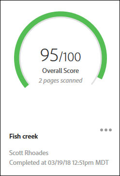

# 감사 목록 페이지{#audit-list-page}

감사 목록 페이지에는 모든 감사에 대한 정보가 표시됩니다.

Adobe Experience Platform Auditor를 시작하면 감사 목록 페이지가 나타납니다. 감사 목록 페이지는 목록 또는 카드 보기로 볼 수 있습니다.

## 목록 보기 {#section-a428749d2ab94a08bf460e6a486b844a}

목록 보기에는 각 감사에 대해 다음 정보가 표시됩니다.

| 항목 | 설명 |
|---|---|
| 감사 이름 | 감사에 지정된 이름 |
| 시작 URL | 감사가 페이지 크롤링을 시작하는 URL |
| 점수 | 감사는 1부터 100까지 점수가 매겨지며, 100점은 검사한 페이지에 문제가 없음을 의미합니다 |
| 상태 | 감사가 완료됨 또는 처리 중임을 표시합니다 |
| 요청자 | 감사를 생성한 사용자의 이름을 표시합니다 |
| 작업 | 감사의 복사 또는 재실행, 현재 실행 중인 감사 취소, 보고서를 [!DNL Excel] 스프레드시트로 다운로드 또는 감사 삭제를 위한 링크를 제공합니다 |

감사 결과를 보려면 감사 이름을 클릭합니다.

## 카드 보기 {#section-6826b585e53a46daa722b9bd3eda926e}

카드 보기는 각 감사를 그래픽 형식으로 표시합니다.

감사 결과를 보려면 감사 이름을 클릭합니다. 이름 옆에 있는 메뉴를 클릭하여 감사 복사, 재실행 또는 취소를 위한 링크를 확인하거나 완료된 보고서를 [!DNL Excel] 스프레드시트 또는 PDF로 다운로드합니다.

