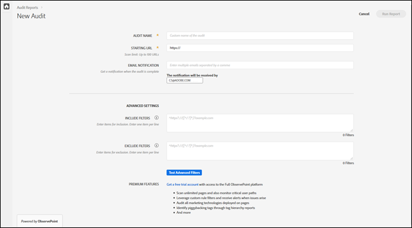

# 시작하기{#getting-started}

## 시작하기 {#task-1024e94b5948413295c9698e62165a04}

<!--
This page is a placeholder for now, we need things like prerequisites, any planning that should be done before using Auditor, initial setup info--that kind of thing.
-->

Auditor를 처음 사용하는 경우 Auditor 계약서를 작성 및 동의해야 합니다. Auditor는 Adobe와 ObservePoint 간의 협업의 일환으로 개발되었습니다. Auditor 사용자는 추가 비용 없이 제한된 ObservePoint 기능을 사용할 수 있습니다. Auditor를 사용하려면 ObservePoint에서 공지에 동의해야 합니다.

## 첫 번째 검사 실행 {#task-b211597afed343cfa238443fcf7c6041}

1. Adobe Experience Cloud 탐색 막대의 오른쪽 위 모서리에 있는 메뉴 버튼을 클릭하고 **[!UICONTROL 활성화]**&#x200B;를 클릭합니다.

   

1. Auditor를 선택하고 사용 약관에 동의합니다.

   Auditor 페이지에서는 새 검사 실행 옵션과 함께 이전 검사 대시보드를 제공합니다.

   

1. **[!UICONTROL 새 감사]**&#x200B;를 클릭합니다.

   새 검사를 실행하려면 화면 오른쪽 상단 모서리에서 **[!UICONTROL 새 감사]**&#x200B;를 클릭합니다.

   

1. 검사를 구성합니다.

   Auditor 이름을 지정하고 시작 URL을 제공한 다음 **[!UICONTROL 보고서 실행]**&#x200B;을 클릭합니다. 스캔이 완료되면 이메일 알림을 받게 됩니다.

   

   모든 구성 옵션에 대한 설명은 [새 감사 만들기](../create-audit/create-new-audit.md)를 참조하십시오.
1. 보고서를 확인합니다.

   검사가 완료되었음을 알리는 이메일을 수신하면 링크를 클릭하여 [보고서를 확인하고](../reports/scorecard.md), 구현을 개선하여 Adobe 솔루션을 통해 더 많은 가치를 얻을 수 있는 기회를 포착합니다.

   또한 [Auditor 페이지](../get-started/audit-list.md)에서 감사 이름을 클릭하여 감사 상태를 확인하고 감사가 완료된 후 보고서를 볼 수도 있습니다.

   
