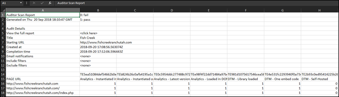

# Download report{#download-report}

보고서는 각 URL이 전달되는지 실패하는지 여부를 보여줍니다.

사용자 인터페이스의 스코어카드 페이지에서 보고서를 볼 수 있습니다. 다음과 같은 보고서를 다운로드할 수도 있습니다.

1. Auditor 목록 또는 스코어카드에서 **[!UICONTROL 보고서 다운로드]**&#x200B;를 클릭합니다.

   보고서를 스프레드시트 또는 PDF 파일로 다운로드할 수 있습니다.
1. 파일을 열지 또는 저장할지 지정합니다.

1. **[!UICONTROL [확인]]**&#x200B;을 클릭합니다.

   스프레드시트는 각 페이지에서 각 테스트가 통과되었는지 실패했는지를 보여줍니다.

   

PDF에는 다음 정보가 표시됩니다.

* 감사 설정
* 완료 타임스탬프
* 전체 점수
* 카테고리별 점수
* 실패한 URL에 적용된 단위 테스트
* 테스트당 Recommendations 및 도움말 문서 링크
