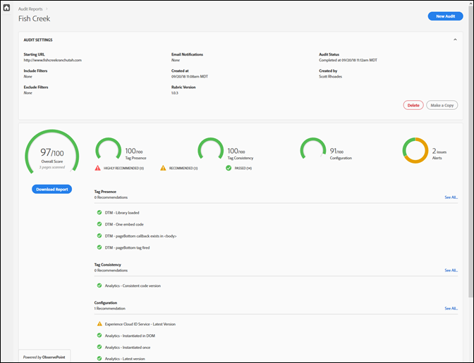
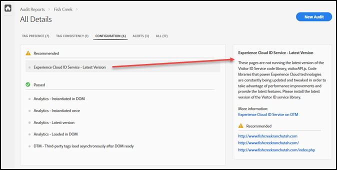

# 스코어카드{#scorecard}

테스트를 실행하면 스코어카드에 감사 정보가 표시됩니다.

Auditor 페이지에서 감사 이름을 클릭하여 테스트 결과를 확인합니다.

스코어카드를 사용하여 다음 카테고리에서 감사가 어떻게 평가되었는지 확인합니다.

* 전체 점수
* 태그 유무

   태그의 존재 여부, 페이지 코드가 올바른 위치에 있는지 여부를 평가합니다.
* 태그 일관성

   URL에서 태그가 일관되는지 여부를 평가합니다.
* 구성

   다른 규칙에 대해 태그를 평가하고 우수 사례를 권장합니다.
* 경고

   알림은 인지해야 하는 문제를 보여주지만 점수에 영향을 주지 않습니다.

점수는 각 테스트의 가중치와 합격 여부에 따라 달라집니다. 합격하면 점수가 테스트 가중치와 같은 점수 수준으로 높아집니다.

* 0: 인지해야 하는 문제에 대해 경고하지만 점수에 영향을 주지 않습니다.
* 1: 최적화를 권장합니다. 데이터 정확성에 영향을 주지 않습니다.
* 2: 이 테스트가 실패하면 Adobe Experience Cloud의 최신 기능 및 수정 사항에 액세스할 수 없게 됩니다.
* 3: 효율성 및 구현이 적극 권장되는 우수 사례를 준수하는지 여부를 테스트합니다.
* 4: 장애는 신뢰할 수 없는 데이터를 수집했음을 의미합니다.
* 5: 장애는 데이터 손실이 발생할 수 있음을 의미합니다.

스코어카드는 사용자가 수정하는 레벨 4 또는 5 문제를 **적극 권장**&#x200B;으로 나열합니다.

스코어카드는 사용자가 수정하는 레벨 1~3 문제를 **권장**&#x200B;으로 나열합니다.

**[!UICONTROL 보고서 다운로드]**&#x200B;를 클릭하여 감사에서 보고한 정보가 포함된 Excel 또는 PDF 파일을 다운로드합니다.

각 카테고리에 대한 점수 외에 권장 또는 매우 권장되는 모든 수정 사항과 테스트를 통과한 항목이 스코어카드에 나열됩니다. 각 문제를 클릭하면 오른쪽 상자에 추가 세부 정보가 표시됩니다. 다시 클릭하여 드릴다운하고 문제 해결 방법에 대한 권장 사항을 확인합니다. 다음은 위에 표시된 스코어카드의 권장 문제에 대한 세부 정보를 보여줍니다.

화면 상단의 카테고리를 클릭하여 각 카테고리에 있는 문제를 확인합니다.

## 어떤 페이지가 테스트의 일부였습니까? {#section-fd38ffeb868648e89c34c5772fa65f46}

테스트를 통과했거나 실패한 URL 목록을 볼 수 있습니다.

스코어카드에서 각 카테고리 머리글 아래에 있는 테스트 이름 또는 **[!UICONTROL 모두 보기]** 링크를 클릭합니다. 이렇게 하면 테스트 세부 사항이 표시됩니다. 각 테스트에 대해 테스트 설명과 실패 또는 통과한 URL 목록을 볼 수 있습니다. 이 정보는 다운로드한 보고서에도 포함되어 있습니다.
